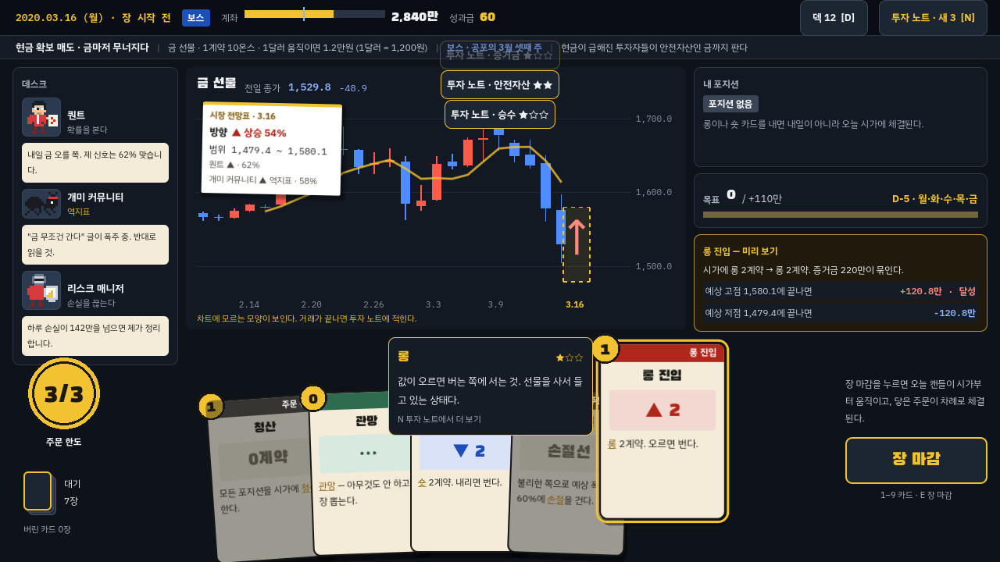
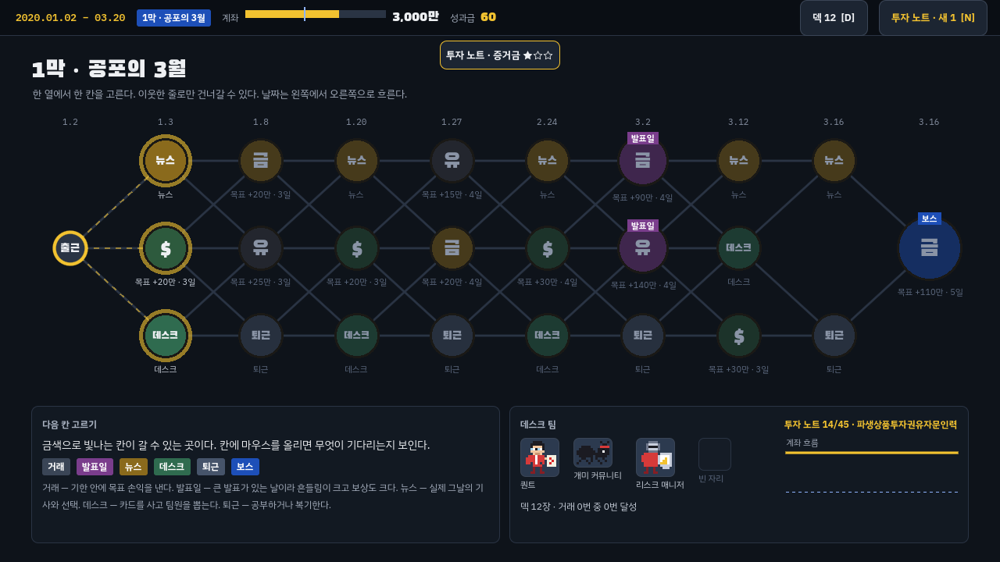
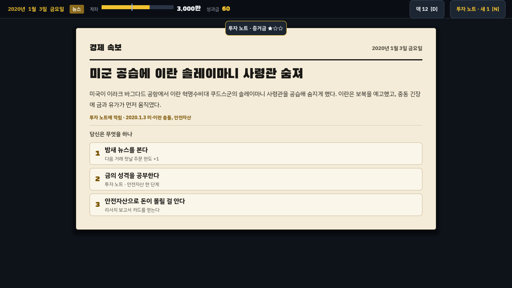
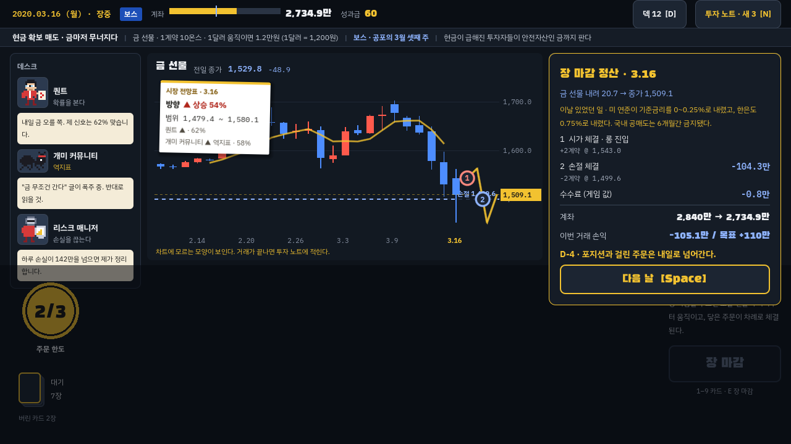
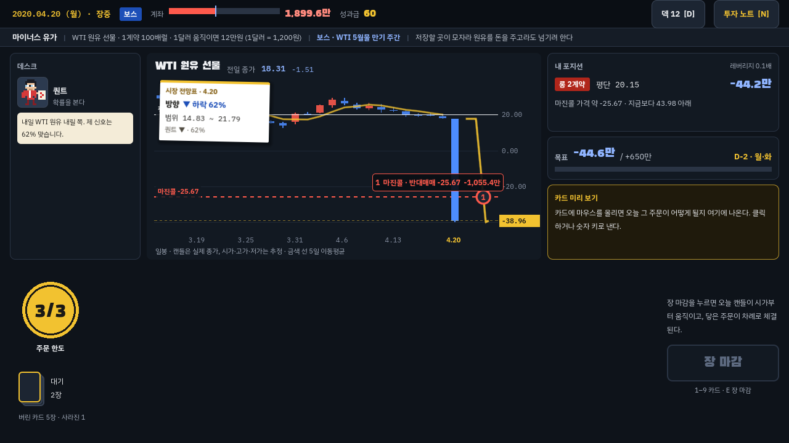
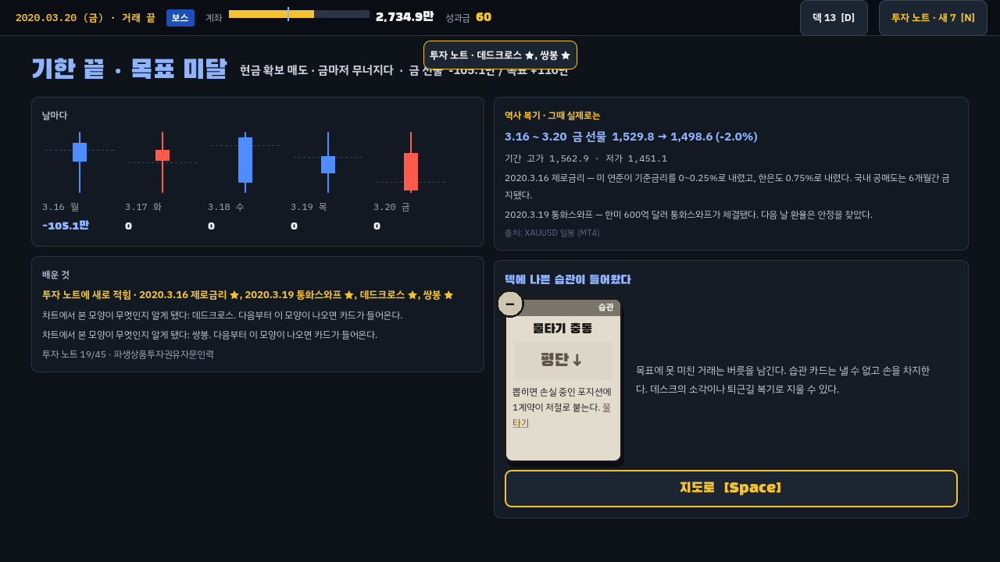
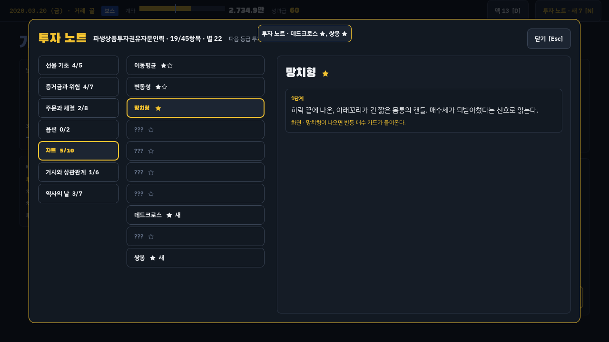

# 차트 던전

**덱빌딩 로그라이크 · 역사 시뮬레이션 · 금융 학습 게임.**
선물 트레이더가 되어 실제로 있었던 시장을 버틴다. 첫 시대는 2020년 팬데믹이다. 공포의 3월을 지나 WTI 마이너스 유가까지 간다.



## 한 판의 흐름

1. **출근**: 계좌 3,000만 원으로 시작한다. 계좌가 곧 체력이다. 1,900만 아래로 떨어지면 증권사가 포지션을 강제로 정리하고(마진콜 · 반대매매) 판이 끝난다.
2. **지도**: 열마다 한 칸을 고른다. 이웃한 줄로만 건너갈 수 있고, 날짜는 왼쪽에서 오른쪽으로 흐른다.
   - 거래 · 발표일: 기한 안에 목표 손익을 내야 한다.
   - 뉴스: 그날의 실제 기사를 읽고 셋 중 하나를 고른다.
   - 데스크: 카드를 사고 팀원을 뽑는다.
   - 퇴근: 공부하거나 복기한다.
   - 보스
3. **거래 (하루 = 한 턴)**
   - 먼저 데스크 팀원의 전망과 시장 전망표를 본다.
   - 카드로 주문을 낸다. 롱·숏 진입, 손절·익절·트레일링, 옵션, 분석 카드가 있다.
   - **장 마감**을 누르면 그날의 실제 캔들이 움직인다. 양봉은 시가 → 저가 → 고가 → 종가, 음봉은 시가 → 고가 → 저가 → 종가로 지나간다.
   - 캔들이 지나가며 닿은 주문이 차례로 체결된다. 끝나면 종가로 손익이 계좌에 들어간다(일일정산).
4. **결과**
   - 목표를 넘기면 성과급과 카드 한 장을 받는다. 못 미치면 덱에 나쁜 습관 카드(물타기 충동, FOMO, 복수 매매, 공포)가 들어온다.
   - 결과 화면의 **역사 복기**에는 그 기간의 실제 시세와 그 무렵 있었던 일이 나온다.
5. **막 복기**: 막이 끝나면 계좌 흐름을 보고 그 시기 역사 퀴즈를 푼다.

### 금융 학습: 투자 노트

- 카드를 쓰고, 뉴스를 읽고, 마진콜을 겪을 때마다 개념이 **투자 노트**에 적힌다. 항목은 45개이고, 한 항목에 1~3단계가 있다.
- 단계가 오르면 화면에 보이는 정보가 늘어난다. 예를 들면 5일 이동평균선, 예상 범위 숫자, 포지션별 마진콜 가격, 레버리지, 정산 계산식이다.
- 차트 패턴은 노트에 있어야 카드로 쓸 수 있다. 모르는 모양은 거래가 끝난 뒤 노트에 적힌다.
- 노트는 판이 끝나도 남는다(`user://notes.json`). 아는 항목 수로 등급이 오른다: 개미 → 파생상품투자권유자문인력 → 투자자산운용사 → 금융투자분석사.

### 전망은 확률이다

역사 모드에서 내일 캔들은 이미 정해져 있다. 퀀트 같은 신호는 정해진 확률(예: 62%)로 그 캔들의 방향을 맞히게 뽑는다. 여러 신호는 베이즈로 합친다. 그래서 "상승 68%"라고 뜨는 날은 길게 보면 정말 68% 정도로 오른다. 개미 커뮤니티는 역지표라서 반대로 읽는다.

| 지도 | 뉴스 |
|---|---|
|  |  |
| **장 마감 정산** | **2020.4.20 마이너스 유가** |
|  |  |
| **거래 결과 · 역사 복기** | **투자 노트** |
|  |  |

## 실행

Godot 4.4 이상에서 돌아간다. 4.4.1과 4.7.2에서 테스트했다.

- 편집기: Godot에서 `chart_dungeon/project.godot`을 열고 F5.
- 명령줄:
  ```sh
  godot --path chart_dungeon
  ```

### 실행 파일 만들기

`export_presets.cfg`에 Windows, Linux, macOS 설정이 들어 있다. Godot 4.4.1 내보내기 템플릿을 설치한 뒤 아래 명령을 쓴다.

```sh
godot --headless --path chart_dungeon --export-release "Windows Desktop" ../build/chart_dungeon/windows/ChartDungeon.exe
godot --headless --path chart_dungeon --export-release "Linux" ../build/chart_dungeon/linux/ChartDungeon.x86_64
godot --headless --path chart_dungeon --export-release "macOS" ../build/chart_dungeon/macos/ChartDungeon.zip
```

- Windows와 Linux는 게임 데이터가 실행 파일 하나에 들어간다.
- macOS 앱은 애플 공증을 받지 않았다. 처음 열 때 한 번만 앱을 우클릭해서 '열기'를 누르거나, 터미널에서 `xattr -cr "차트 던전.app"`을 실행한다.
- 투자 노트는 여기에 저장된다: Windows `%APPDATA%\Godot\app_userdata\차트 던전\notes.json`, macOS `~/Library/Application Support/Godot/app_userdata/차트 던전/`.

### 조작

| 키 | 동작 |
|---|---|
| 클릭 / 1–9 | 카드 내기 (마우스를 올리면 오늘 결과를 미리 본다) |
| E / Enter | 장 마감 |
| Space | 정산 넘기기 · 다음 |
| N | 투자 노트 |
| D | 덱 보기 |
| M | 소리 켜고 끄기 |
| 1–3 | 지도에서 칸 고르기, 뉴스 선택, 퀴즈 답 |

## 테스트와 도구

```sh
cd chart_dungeon
godot --headless --path . --import            # 처음 한 번 (글꼴 경고가 나면 한 번 더)
godot --headless --path . --script res://tests/run_tests.gd
godot --headless --path . --script res://tools/balance_sim.gd -- 60
xvfb-run -a -s "-screen 0 1280x720x24" godot --path . --rendering-driver opengl3 \
  --script res://tools/capture.gd -- /tmp/shots
```

| 경로 | 하는 일 |
|---|---|
| `tests/` | 엔진(체결 순서, 갭, 일일정산, 마진콜, 신호 보정, 습관), 지도·뉴스·데스크 테스트. 실제 `main` 장면을 띄워 타이틀부터 판 끝까지 화면 조작만으로 가는 UI 테스트도 있다. |
| `tools/balance_sim.gd` | 거래 칸마다 봇 두 종류로 목표 달성률을 잰다. |
| `tools/capture.gd` | 화면을 차례로 띄워 PNG로 저장한다. |
| `tools/check_scripts.gd` | 모든 스크립트의 문법 오류를 찾는다. |
| `tools/build_market_data.py` | 공개 시세를 받아 `data/market/*.csv`를 만든다. 받아 둔 원본만 쓰려면 `--offline`. |
| `tools/import_ohlc_csv.py` | KRX나 증권사에서 받은 일봉 CSV(cp949/utf-8, `일자/시가/고가/저가/종가`)를 게임 형식으로 바꾼다. 예: `python3 tools/import_ohlc_csv.py 받은파일.csv usdkrw`. 실제 시가·고가·저가가 들어가고 `est=0`이 된다. |

## 데이터와 한계

| 상품 | 계열 | 시가·고가·저가 |
|---|---|---|
| 미국달러 선물 | 미 연준 H.10 원/달러 일별 환율 (뉴욕 정오 기준) | 종가로 추정 |
| 금 선물 | XAUUSD 일봉 (MT4) | 실제 값 |
| WTI 원유 선물 | 미 에너지정보청 WTI 쿠싱 현물 | 종가로 추정 |

- 기간은 2019.09–2020.12 평일이다. 종가는 모두 실제 값이다.
- 추정한 시가·고가·저가는 날짜마다 늘 같은 값이 나오게 해시로 정했다.
- 추정 대신 실제 장중 흐름을 따른 날이 하나 있다. 2020.4.20 WTI는 5월물 선물이 17.73달러에서 시작해 장중 -40.32달러까지 밀리고 -37.63달러에 정산한 흐름을 현물 종가에 맞춰 옮겼다.
  - 출처: 미 의회조사국 IN11354, 미 에너지정보청 Today in Energy 43495
- 원/달러는 서울 시장 종가가 아니라 뉴욕 정오 환율이다. 그래서 서울 종가와 조금 다르다. 예를 들어 2020.3.19는 서울 1,285.7원, 이 계열 1,250.9원이다.
- 코스피200 선물은 공개 일봉을 구하지 못해 넣지 않았다. KRX에서 받은 CSV가 있으면 `import_ohlc_csv.py`로 넣을 수 있다.
- 계약 크기에서 실제 규격은 달러 선물의 1원 = 1만 원뿐이다. 금·원유의 승수, 모든 상품의 증거금, 수수료는 게임 값이다.

## 폴더

```
chart_dungeon/
  core/      엔진: 시세, 포지션, 주문, 거래(하루 처리), 카드, 신호, 패턴, 투자 노트, 2020 시대 지도·뉴스
  ui/        공통 모양(Look), 카드, 차트, 윗줄, 도트 초상, 효과음, 투자 노트·덱 창
  screens/   타이틀, 브리핑, 지도, 거래, 결과, 뉴스, 데스크, 퇴근, 막 복기, 판 결과
  scenes/    main (화면 전환)
  data/      시세 CSV
  fonts/     Black Han Sans, IBM Plex Sans KR, IBM Plex Mono, Galmuri11 (모두 SIL OFL 1.1, 라이선스 파일 동봉)
```

그림 파일은 없다. 카드, 차트, 도트 인물, 효과음은 모두 코드로 그리고 만든다.
