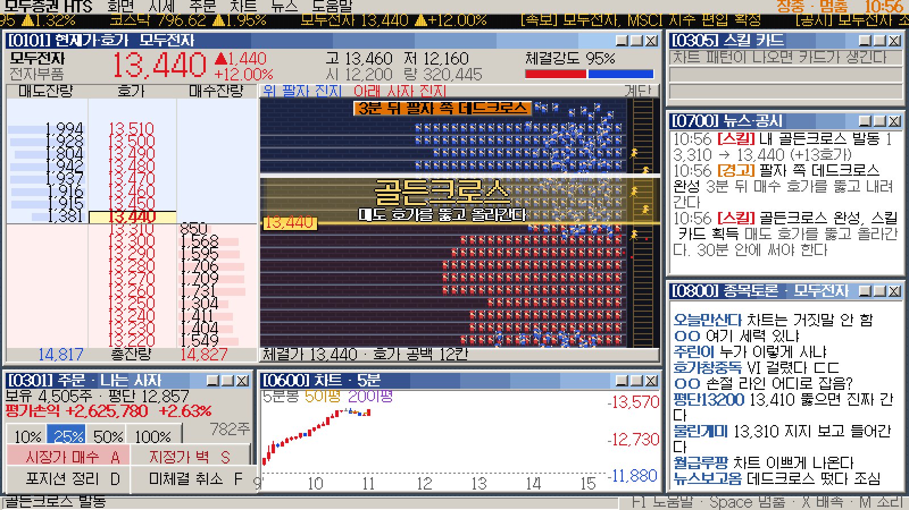

# 호가전쟁

모두증권 HTS 화면 안에서 벌어지는 하루짜리 전쟁이다. 종목 하나를 두고 사자(매수)와 팔자(매도)가 붙고,
나는 한쪽에 서서 밑천 1억으로 싸운다. 규칙과 설계 이유는 [`docs/orderwar.md`](../docs/orderwar.md)에 있다.



## 실행

Godot 4.4 이상에서 `godot/project.godot`을 가져와 F5. 800×450 도트 화면을 정수배로 키워서 그린다
(기본 창 1600×900). Godot 4.4.1과 4.7.2에서 돌려 봤다.

## 한 판

| 시각 | 무슨 일 |
| --- | --- |
| 08:50 | 장전 동시호가. 주문이 쌓이기만 하고 09:00에 시가 한 가격으로 체결된다 |
| 09:00 | 장중. 시장가는 호가를 먹고 지정가는 쌓인다. 10% 급변하면 2분 VI(다시 동시호가) |
| 11:30 | 점심. 거래도 뉴스도 줄어든다 |
| 15:20 | 장 마감 동시호가. 마지막 10분에 모인 주문이 종가를 정한다 |
| 15:30 | 종가가 기준가 위면 사자, 아래면 팔자 승 |

장중 1분은 0.5초, 동시호가 1분은 1초라 한 판이 3분 반쯤 걸린다.

## 화면

- **[0101] 현재가·호가**: 왼쪽은 호가표, 오른쪽은 같은 줄에 맞춘 탑이다. 호가 한 줄이 탑의 한 층이고
  그 층의 병사 수가 잔량이다. 위 열 층은 팔자, 아래 열 층은 사자가 지키고, 노란 이음매가 체결가다.
  시장가가 매도 호가 세 칸을 먹으면 위 세 층이 무너지며 병사가 떨어지고 탑이 세 칸 내려앉는다.
  오른쪽 계단으로는 돌격대가 오르내린다. 개미는 개미, 기관은 방패병, 외국인은 창기병, 세력은 고래다.
  내 주문은 금색 병사, 공시가 세운 벽(매수청구가, 신주 물량)은 모래주머니다.
  동시호가 중에는 시장가 주문이 계단에 줄을 서 있다가 체결되는 순간 한 가격이 박힌다.
- **[0301] 주문**: 잔고와 평가손익, 수량 비율, 시장가 돌격·지정가 벽·포지션 정리·미체결 취소.
- **[0305] 스킬 카드**: 5분봉에 내 편 차트 패턴이 나오면 카드가 들어온다. 30분 안에 써야 한다.
- **[0600] 차트**: 하루치 5분봉 78개가 한 화면에 다 들어간다.
- **[0700] 뉴스·공시**, **[0800] 종목토론**: 공시와 매크로 뉴스, 그걸 보고 떠드는 개미들.
- 맨 위 전광판에는 지수와 방금 나온 뉴스가 흐른다.

## 조작

| 키 | |
| --- | --- |
| A | 시장가 돌격 |
| S | 지정가 벽 (우리 편 최우선 호가에) |
| D | 포지션 정리 |
| F | 미체결 취소 |
| Q W E | 스킬 카드 |
| 1 ~ 4 | 수량 10 · 25 · 50 · 100% |
| 호가 클릭 | 그 가격에 지정가 (상대 호가를 누르면 거기까지 바로 체결) |
| Space · X · M | 멈춤 · 2배속 · 소리 |
| F1 · Esc | 도움말 · 나가기 |

관심종목에서는 ↑↓로 고르고 Enter가 사자, Shift+Enter가 팔자다.

## 구조

| 경로 | |
| --- | --- |
| `core/` | 게임 규칙. 노드를 쓰지 않는 순수 로직이라 헤드리스로 테스트된다 |
| `core/order_book.gd` | 가격·시간 우선 호가창과 동시호가 (예상체결가 계산, 단일가 체결) |
| `core/battle_engine.gd` | 하루 시뮬레이션: 장 흐름, NPC 주문, 뉴스, VI, 패턴→스킬, 승패, 계좌 |
| `core/chatter.gd` | 종목토론방 대사 |
| `ui/hts.gd` | 창 테두리, 색, 글꼴 같은 HTS 화면 규칙 |
| `ui/book_tower.gd` | 호가표와 탑 |
| `ui/pixel_art.gd` | 도트 그림 (글자 하나가 픽셀 하나) |
| `ui/sfx.gd` | 체결음, 종, 스킬, VI 경보 (코드로 합성) |
| `tests/`, `tools/` | 테스트, 밸런스 시뮬레이터, 화면 캡처 |

## 테스트·도구

```sh
godot --headless --path godot --import                                    # 처음 한 번
godot --headless --path godot --script res://tests/run_tests.gd           # 43개
godot --headless --path godot --script res://tools/balance_sim.gd -- 100  # 종목당 100판
godot --path godot --script res://tools/capture.gd -- <폴더>              # 화면 캡처
```

## 글꼴

갈무리11 (© Lee Minseo), SIL Open Font License 1.1. [`fonts/OFL.txt`](fonts/OFL.txt)
